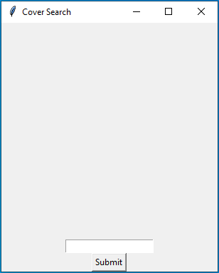
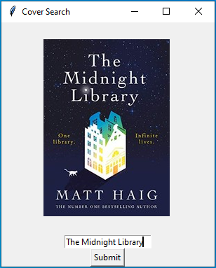

# Book-Cover

Run the controller with the model and view in the same directory. Input the name of the book and a cover
corresponding to the book will return in the window.

Running the controller will bring up this GUI, which will prompt the user to enter the title of a book.

In this example, the book "The Midnight Library" was used to generate the cover.
